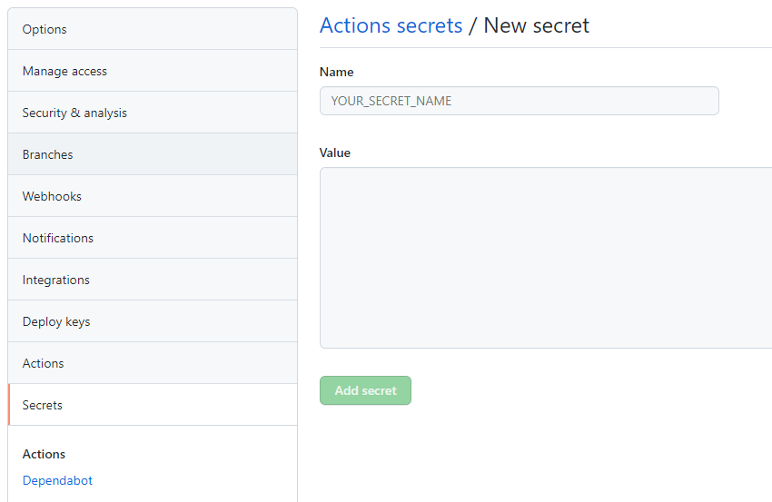
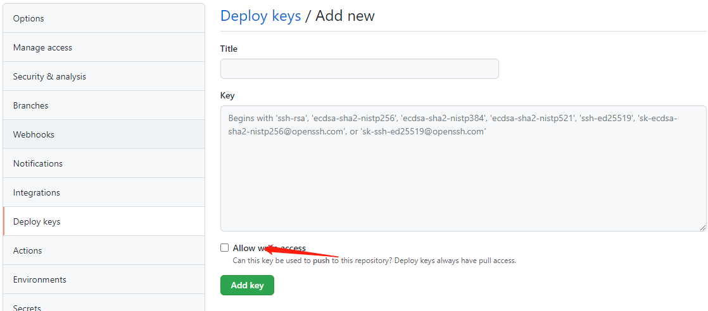

# 工作流
整个方案的流程大致如下：

1. 用 Markdown 格式写作文章。

2. 使用生成器将 markdown 文件转换成静态站点。

3. 将生成的站点内容推送到 GitHub 并发布。

   写 markdown 没啥好说的，什么编辑器都可以，我一直用的是 Typora。静态站点生成器我选择了 Hugo，原因是最近刚好在学 Go，此外还有 Gatsby、Jekyll、Hexo等很多选项。接下来要做的工作是生成静态站点并通过GitHub Pages 发布。

   

# 准备工作

1. 创建一个项目仓库（hugo工程目录，相当于源码，名称随意）

2. 创建一个主页仓库（相当于静态页面目录，必须是 <USERNAME>.github.io，其中<username>是你的github用户名）

   

# 生成静态站点

​	使用 Hugo 生成静态博客站点非常简单，具体的步骤和用法可以参考官方文档的 Quick Start。下面简单介绍下整个过程：

​	安装 Hugo。macOS 下可以直接使用 homebrew安装：brew install hugo。

​	创建一个新的站点。这会生成一个特定目录结构的项目文件夹，用来维护所有的站点内容。假设我们想把它命名为`hugo-blog`，则使用以下命令创建并切换到该目录，后续的操作和命令都会在这个根目录下执行：
```
hugo new site hugo-blog
cd hugo-blog
```
安装一个主题。这一步是必需的，否则会因为缺少基础模板无法生成站点。安装主题有 3 种方式，以 `eureka` 主题为例：

直接下载主题的压缩文件，将解压得到的文件夹重命名为主题名称 eureka 放到 themes/目录下。

通过 `git submodule` 安装：
```
git init
git submodule add https://github.com/wangchucheng/hugo-eureka.git themes/eureka
```
通过 Hugo Modules 安装（这种方式要求本机安装有 Go 1.12 及以上版本，且只有部分主题支持）：
```
hugo mod init <module_name>
```
`<module_name>` 并不重要，随便起个名字就行。

安装后需要启用主题，方法是将主题名称写入到根目录下的默认配置文件 config.yml 中：

`echo 'theme = "eureka"' >> config.toml`
如果是通过 Hugo Modules 安装，需要把主题名称替换成模块名称：

`echo 'theme = "github.com/wangchucheng/hugo-eureka"' >> config.toml`

​	添加一篇文章。可以直接在 content/posts 目录下创建 markdown 文件，但需要手动写入一些元信息，因此推荐使用 Hugo 自带的命令：hugo new posts/my-first-post.md，添加的文件会以如下元信息开头：

```
---
title: "My First Post"
date: 2019-03-26T08:47:11+01:00
draft: true
---
```
​	在下方接着写入文章内容即可。注意此时该文件为草稿状态，写作完成后需要改成 draft: false 才能部署。

​	启动 Hugo 预览服务器。Hugo 可以启动一个 Web 服务器，同时构建站点内容到内存中并在检测到文件更改后重新渲染，方便我们在开发环境实时预览对站点所做的更改。

`hugo server -D`
添加 -D 选项以输出草稿状态的文章，执行成功后可以通过 http://localhost:1313/ 访问站点。

​	自定义主题配置。站点的配置项默认保存在根目录的 config.toml 文件中，配置项较多时通常会用主题提供的预设配置文件来替换该文件，还可以通过config 目录加多个文件的方式来组织配置。默认配置文件如下：
```
baseURL = "http://example.org/"      # 发布地址，由主机名以及路径组成
languageCode = "en-us"               # 语言代码，中文可以设置为"zh"
title = "My New Hugo Site"           # 站点标题
```
​	这一步应该是整个过程中最麻烦也是最容易出问题的一步，视乎你选择的主题与想要的功能不同，需要自定义的配置项也不同，数量从几个到上百个不等。有些主题会有详细的文档解释配置过程，有些则一笔带过只能自己去摸索，配置较多时相互间可能还有依赖关系，最好更改一个配置就刷新一次页面确认下结果。

​	建议起步时一切从简，花大把时间搞各种花里胡哨的样式和功能，还不如多写几篇文章。

​	构建静态页面。站点配置成我们理想的效果之后就可以构建静态页面了：

`hugo -D`
添加 -D 选项可以在结果中包括草稿内容，默认情况下静态页面会输出到根目录下的 public 文件夹中。


# 发布步骤

1. 在 GitHub 创建个人主页仓库，仓库名称必须设置为 `<USERNAME>.github.io`，这个仓库仅存放生成的静态内容。

2. 在 GitHub 创建一个项目仓库 `hugo-blog` 并添加为我们本地项目文件夹的远程仓库。这个仓库用来维护站点配置和原始的文章内容。

3. 假设我们在已经通过上文的步骤在 `public` 文件夹中生成了想发布的静态内容，运行：

   ```
   git submodule add -b main https://github.com/<USERNAME>/<USERNAME>.github.io.git public
   ```

   在 `public` 目录中创建一个 git 子模块，之后这个目录将以 `https://github.com/<USERNAME>/<USERNAME>.github.io` 作为远程仓库。如果出错，请先提交一次代码

4. 确保配置文件中的 `baseUrl` 已经设置为了 `https://<USERNAME>.github.io/`。

```
git submodule add -b main https://github.com/<USERNAME>/<USERNAME>.github.io.git public
```

切换到public目录，push到主页目录
```
cd public
git push
```

大功告成！稍等几分钟就可以在 `https://<USERNAME>.github.io` 看到我们的个人博客了。


# 通过 GitHub Pages 发布

​	通过个人主页发布：必须创建一个 <USERNAME>.github.io 仓库来托管生成的静态内容，发布后的域名为 https://<USERNAME>.github.io，我们需要将 config.yml 中的 baseUrl 设置为不同的值。


# 通过 GitHub Actions 自动部署

目前我们的「创作-发布」流程如下：

1. 在项目仓库编辑原始内容并进行版本管理。

2. 执行自动脚本生成静态站点并推送到个人主页仓库完成发布。

   

   这套流程已经很流畅，但还有一些改进空间：我们可以使用 GitHub Actions，在每次向远程的项目仓库推送原始内容更改时自动执行第 2 步进行发布。

   GitHub 上有许多这类自动化部署任务的开源 Actions 项目，我们选择了其中一个简单易用的 GitHub Actions for Hugo。具体的操作步骤截图和详细配置项可以查看该项目的 README。下面简单介绍下配置过程：

在项目文件夹中添加目录和文件：`.github/workflows/gh-pages.yml`，gh-pages.yml 文件内容如下：
```
name: github pages

on:
  push:
    branches:
      - main  # 每次推送到 main 分支都会触发部署任务

jobs:
  deploy:
    runs-on: ubuntu-18.04
    steps:
      - uses: actions/checkout@v2
        with:
          submodules: true  # Fetch Hugo themes (true OR recursive)
          fetch-depth: 0    # Fetch all history for .GitInfo and .Lastmod

      - name: Setup Hugo
        uses: peaceiris/actions-hugo@v2
        with:
          hugo-version: '0.79.1'
          extended: true
       
      - name: Build
        run: hugo --minify
       
      - name: Deploy
        uses: peaceiris/actions-gh-pages@v3
        with:
          deploy_key: ${{ secrets.ACTIONS_DEPLOY_KEY }}
          external_repository: <USERNAME>/<USERNAME>.github.io  # 替换成上文所创建的个人主页仓库
          publish_branch: main  #默认是master，我这里修改了一下分支名称
          publish_dir: ./public
```
这个文件所定义的 workflow 基于项目仓库运行，但我们需要将运行过程生成的静态文件推送到个人主页仓库 <USERNAME>.github.io 完成发布，因此在 Deploy 任务中按照文档的 Deploy to external repository external_repository 一节做了专门的配置。

在本地生成 SSH 部署密钥：
```
ssh-keygen -t rsa -b 4096 -C "$(git config user.email)" -f gh-pages -N ""
# 将在当前目录生成如下密钥文件:
#   gh-pages.pub (公钥)
#   gh-pages     (私钥)
```
在 GitHub 分别进入`项目仓库`和`个人主页仓库`的 Settings 页面：

将公钥 `gh-pages` 作为` Secret` 添加到项目仓库，并设置` Name` 为` ACTIONS_DEPLOY_KEY`。




将私钥` gh-pages.pub` 作为` Deploy Key `添加到个人主页仓库，并设置为 `Allow write access`。




接下来我们测试一下效果。

​	在本地做一些更改，预览效果后提交并推送，然后在项目仓库的 GitHub Actions 页面检查相应的 workflow 是否运行成功。不出意外的话，很快个人主页仓库将新增一个由该 workflow 创建的提交，访问个人博客页面也会发现页面已经更新。

# 参考：
https://www.waynerv.com/posts/setup-blog-with-hugo-and-github-pages/